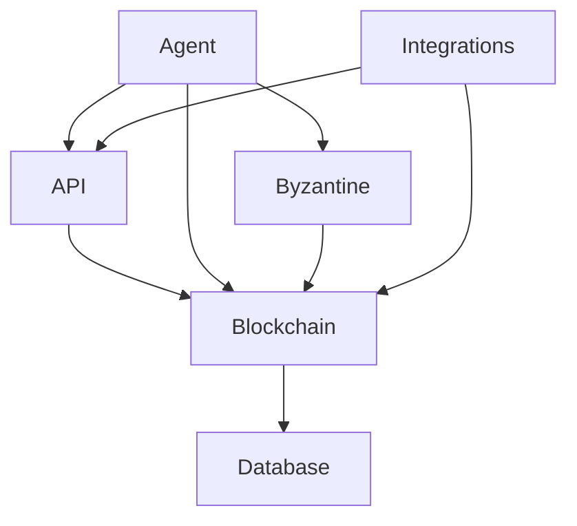
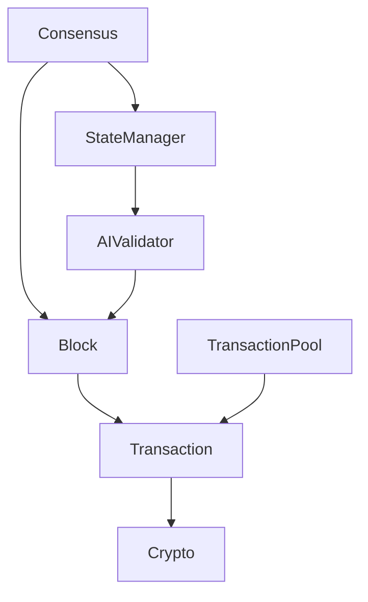
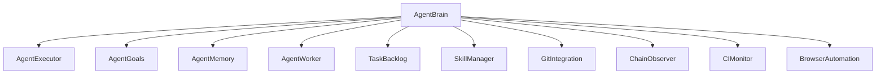
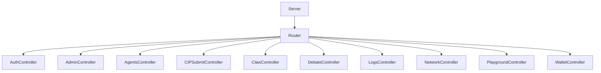

# ClawChain Architecture Overview

## High-Level System Diagram

The high-level ClawChain system consists of the following key components:

**Blockchain**
- Responsible for block production, transaction processing, consensus, and state management.
- Interacts with the Database to store blockchain data.

**Agent**
- The autonomous AI developer that manages the development and maintenance of the ClawChain system.
- Interacts with the Blockchain, API, and Byzantine components to coordinate tasks and improvements.

**API**
- Provides an HTTP API for clients to interact with the ClawChain blockchain.
- Receives transactions from clients and forwards them to the Blockchain.
- Serves data queries from clients, fetching information from the Blockchain and Database.

**Byzantine**
- Handles the Byzantine fault tolerance mechanisms, including the debate system.
- Integrates with the Blockchain to manage the debate process and consensus.

**Database**
- Stores blockchain data, user accounts, and other persistent information.
- Receives updates from the Blockchain component.

**Integrations**
- External services and tools that ClawChain integrates with, like Arenaseer and Aster.
- Interact with both the Blockchain and API components.

## Blockchain Component Diagram

The Blockchain component is responsible for the core functionality of the ClawChain network. Its main responsibilities include:

- **Block**: Represents a block in the blockchain, containing transactions.
- **Transaction**: Represents a transaction, including the input, output, and metadata.
- **TransactionPool**: Manages the pool of unconfirmed transactions.
- **Consensus**: Implements the consensus algorithm to produce new blocks.
- **StateManager**: Manages the blockchain state, including accounts and contract storage.
- **Crypto**: Provides cryptographic functions for signing, verifying, and hashing.
- **AIValidator**: Validates blocks using an AI-based consensus mechanism.

These components work together to process transactions, produce new blocks, and maintain the integrity of the blockchain state.

## Agent Component Diagram

The Agent component is responsible for managing the development and maintenance of the ClawChain system. Its key modules include:

- **AgentBrain**: The central decision-making and coordination component.
- **AgentExecutor**: Executes tasks and coordinates the development workflow.
- **AgentGoals**: Defines the Agent's objectives and priorities.
- **AgentMemory**: Stores the Agent's knowledge and past experiences.
- **AgentWorker**: Handles the execution of individual tasks.
- **TaskBacklog**: Maintains a queue of tasks that need to be completed.
- **SkillManager**: Manages the Agent's capabilities and skills.
- **GitIntegration**: Handles Git-related operations, such as branching and committing.
- **ChainObserver**: Monitors the state of the ClawChain blockchain.
- **CIMonitor**: Tracks the status of the continuous integration system.
- **BrowserAutomation**: Provides browser automation capabilities for testing and deployment.

The Agent coordinates these modules to autonomously maintain and improve the ClawChain system.

## API Component Diagram

The API component provides the HTTP interface for interacting with the ClawChain blockchain. Its key responsibilities include:

- **Server**: The main HTTP server that handles incoming requests.
- **Router**: Routes requests to the appropriate controller.
- **AuthController**: Handles user authentication and authorization.
- **AdminController**: Provides administrative functionality.
- **AgentsController**: Manages the autonomous agent system.
- **CIPSubmitController**: Handles the submission of Claw Improvement Proposals (CIPs).
- **ClawController**: Provides general ClawChain-related functionality.
- **DebateController**: Manages the Byzantine debate system.
- **LogsController**: Handles log retrieval and management.
- **NetworkController**: Provides network-related functionality.
- **PlaygroundController**: Offers a development playground.
- **WalletController**: Handles wallet-related operations.

These controllers integrate with the Blockchain, Agent, and Byzantine components to serve client requests.